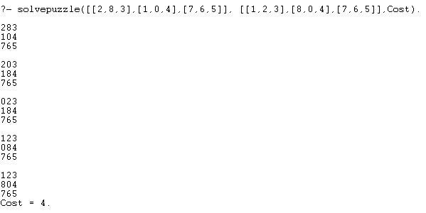

# 8-puzzle solver using A* in prolog

## Board
In this puzzle you have 8 tiles and each tile is represented with a number from 1 to 8 and there is also an empty space.

## Rules
- You can only move tiles horizontally or vertically where there is an empty space.
- You win when you reach the desired configuration of tiles
- Each move will have a cost of 1

## Hot to use
- You need an interpreter to consult the program puzzle.pl. I used a program called SWI Prolog to consult my program
- To solve an 8-puzzle you need to call the predicate solvepuzzle with the following parameters
- First parameter is the initial state.
- Second parameter is the goal state.
- Third parameter is a variable called Cost that returns the total cost to reach the desired configuration.

Example

`solvepuzzle([[1,3,4],[8,0,5],[7,2,6]], [[1,2,3],[8,0,4],[7,6,5]],Cost).`

## Output
If the puzzle is solvable it returns the total cost with each step to solve it.

If the puzzle is not solvable it returns "No soution"

## Test Cases
You can find additional test cases in the filled called text_cases.txt